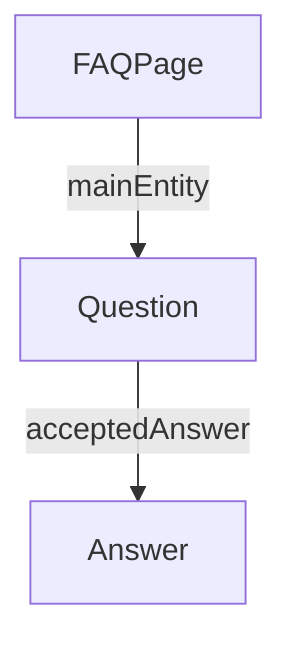
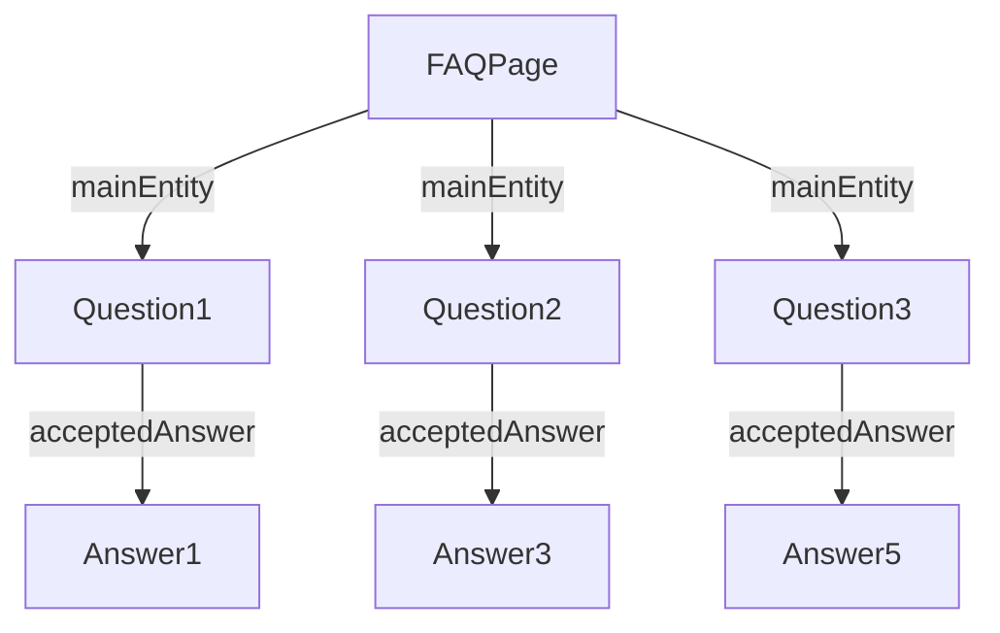

# FAQ

## Schema.org

### Types

- [https://schema.org/FAQPage](https://schema.org/FAQPage)
- [https://schema.org/QAPage](https://schema.org/QAPage)
- [https://schema.org/Question](https://schema.org/Question)
- [https://schema.org/Answer](https://schema.org/Answer)

## Links

[https://developers.google.com/search/docs/appearance/structured-data/faqpage?hl=de](https://developers.google.com/search/docs/appearance/structured-data/faqpage?hl=de)

[https://honeynjam.com/tools/schema-markup-generators/qapage](https://honeynjam.com/tools/schema-markup-generators/qapage)

## Konzept





### Properties

- name
- text

!!! warning

    Question und Answer verwenden "https://schema.org/text" nicht "https://schema.org/description"!
    Wie alle https://schema.org/CreativeWork

## Examples

```JSON
{
  "@context": "https://schema.org",
  "@type": "FAQPage",
  "mainEntity": [{
    "@type": "Question",
    "name": "How to find an apprenticeship?",
    "acceptedAnswer": {
      "@type": "Answer",
      "text": "<p>We provide an official service to search through available apprenticeships. To get started, create an account here, specify the desired region, and your preferences. You will be able to search through all officially registered open apprenticeships.</p>"
    }
    }, {
      "@type": "Question",
      "name": "Whom to contact?",
      "acceptedAnswer": {
        "@type": "Answer",
        "text": "You can contact the apprenticeship office through our official phone hotline above, or with the web-form below. We generally respond to written requests within 7-10 days."
      }
    }]
}
```

### Question

```
    <script type="application/ld+json">
    {
        "@context": "https://schema.org",
        "@type": "Question",
        "name": "What is attr_accessor in Ruby?",
        "upvoteCount": "196",
        "text": "I am having difficulty understanding Ruby attr_accessors, can someone explain them?",
        "dateCreated": "2010-11-04T20:07Z",
        "author": {
            "@type": "Person",
            "name": "someuser"
        },
        "answerCount": "4",
        "acceptedAnswer": {
            "@type": "Answer",
            "upvoteCount": "1337",
            "text": "(The text of the accepted answer goes here...).",
            "dateCreated": "2010-12-01T22:01Z",
            "author": {
                "@type": "Person",
                "name": "someuser"
            }
        },
        "suggestedAnswer": {
            "@type": "Answer",
            "upvoteCount": "39",
            "text": "(The text of the accepted answer goes here...).",
            "dateCreated": "2010-12-06T21:11Z",
            "author": {
                "@type": "Person",
                "name": "lonelyuser1234"
            }
        }
    }
    </script>
```
