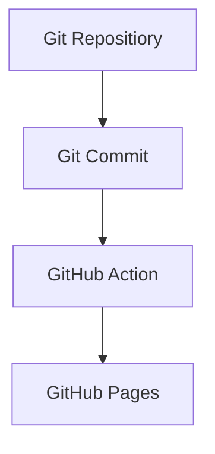
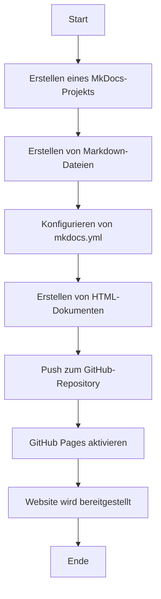

# OpenData Portal

```mermaid
graph TD;
    A[Git Repositiory] --> B[Git Commit]
    B --> C[GitHub Action]
    C --> E[GitHub Pages]
```

Prozess Open Data

```mermaid
graph TD;
    A[Start] --> B[Erstellen eines MkDocs-Projekts]
    B --> C[Erstellen von Markdown-Dateien]
    C --> D[Konfigurieren von mkdocs.yml]
    D --> E[Erstellen von HTML-Dokumenten]
    E --> F[Push zum GitHub-Repository]
    F --> G[GitHub Pages aktivieren]
    G --> H[Website wird bereitgestellt]
    H --> I[Ende]
```