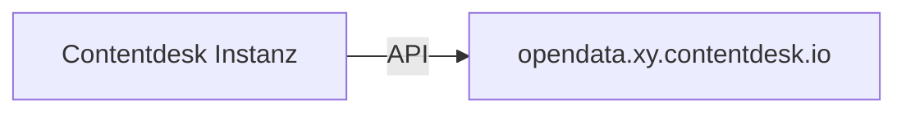
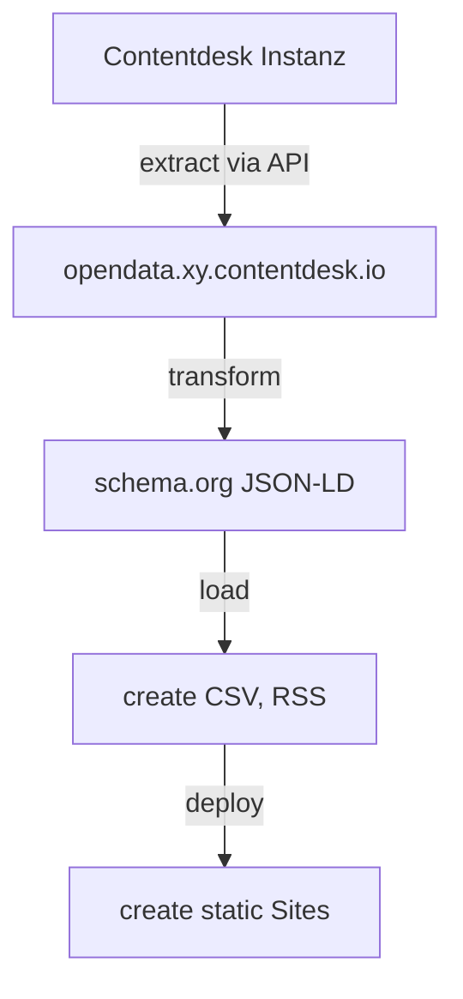
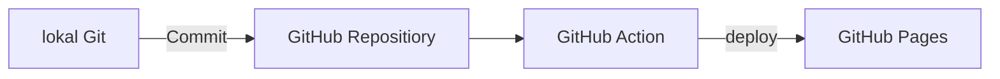
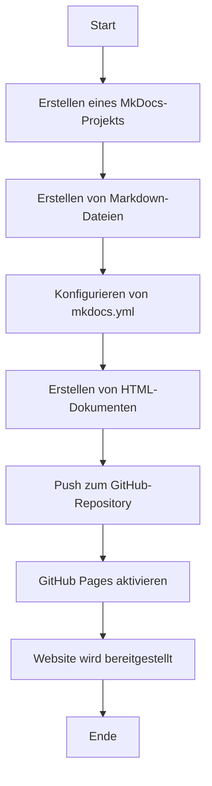

# OpenData Portal

```mermaid
graph LR;
    A[Contentdesk Instanz] -->|API| B[opendata.xy.contentdesk.io]
```

* Alle Objekte die als CC-Lizenz (bspw. cc by sa, etc) defineirt sind
* Vollständig
* und aktive
* Jeden Tag um 00:00 Uhr

```mermaid
graph TD;
    A[Contentdesk Instanz] -->|extract via API| B[opendata.xy.contentdesk.io]
    B -->|transform| C[schema.org JSON-LD]
    C -->|load| D[create CSV, RSS]
    D -->|deploy| E[create static Sites]
```

```mermaid
graph LR;
    A[lokal Git] -->|Commit| B[GitHub Repositiory]
    B --> C[GitHub Action]
    C -->|deploy| D[GitHub Pages]
```

Prozess Open Data

```mermaid
graph TD;
    A[Start] --> B[Erstellen eines MkDocs-Projekts]
    B --> C[Erstellen von Markdown-Dateien]
    C --> D[Konfigurieren von mkdocs.yml]
    D --> E[Erstellen von HTML-Dokumenten]
    E --> F[Push zum GitHub-Repository]
    F --> G[GitHub Pages aktivieren]
    G --> H[Website wird bereitgestellt]
    H --> I[Ende]
```