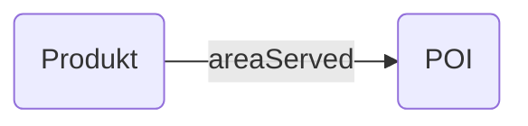

---
tags:
  - property
hide:
  - navigation
---

# areaServed
Property

[https://schema.org/areaServed](https://schema.org/areaServed)

Verknüpfung

## Definition
Dieses Attribut beschreibt das geografische Gebiet, in dem ein Dienst oder ein Produkt verfügbar ist. Es kann sich um ein Land, eine Region oder eine Stadt handeln.

## Beispiel

### Product / Place


``` json
{
  "@context": "https://schema.org",
  "@type": "Service",
  "name": "Beispiel Dienst",
  "areaServed": {
    "@type": "Place",
    "name": "Schweiz"
  }
}

```

## Ähnliche Verknüpfungen

* [availableAtOrFrom](/schema/availableAtOrFrom)


## Hinweise

!!! info "Hinweis"
    Bei wird areaServed statt availableAtOrFrom für die Verknüpfung der Produkte mit einem POI verwendet.
    https://docs.discover.swiss/dev/concepts/offers/

